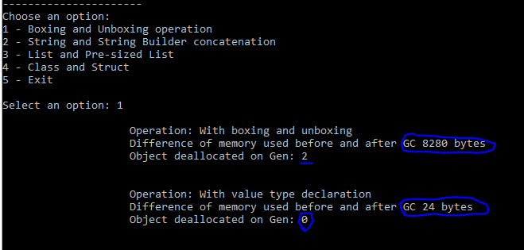
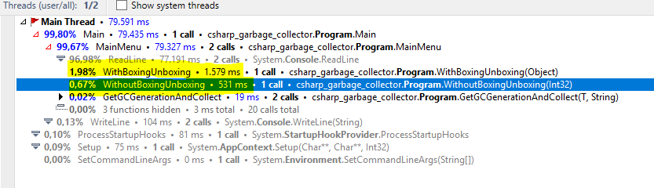
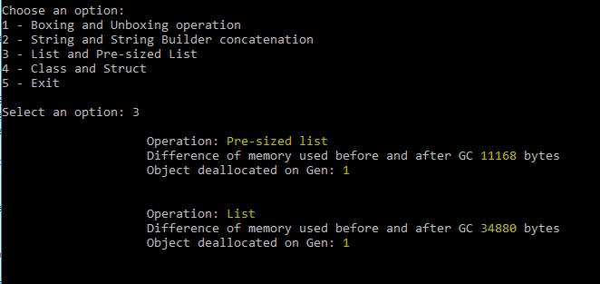
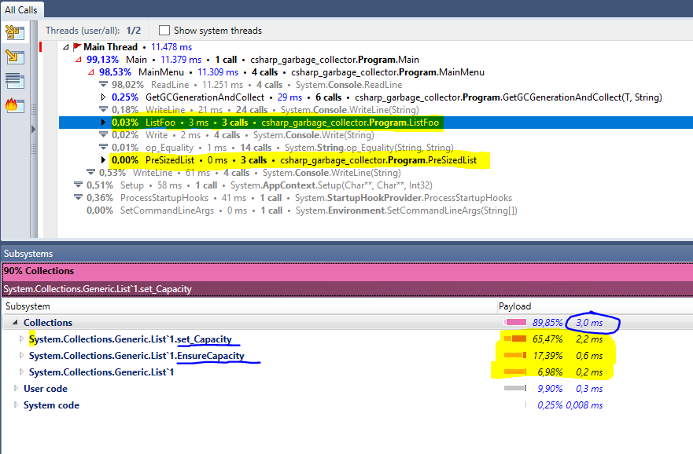
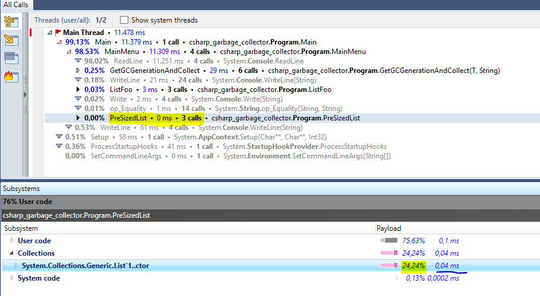

# How to improve your code knowing how the Garbage Collector works in C# 
 
Additional documentation can be found here: https://docs.microsoft.com/en-us/dotnet/standard/garbage-collection/fundamentals

This repository has 1 console .Net Core project. It was made to research.

## Tech stack

.Net Core console application and Visual Studio Community 2019

## How to run the examples and see the results

Just set the GarbageCollector project to startup project, select the option to see the results benchmark. Also try to use a profiling tool to see the Heap and the GC moves between generations. This project is written with partial classes of the main Program class for the sake of simplicity, so all examples are just files in the /Comparisons folder and called in the Main Menu. You can see which approach is the most performatic after selecting it in the main menu and then seeing the snapshot taken by your favorite memory profiler for .Net. I used JetBrains dotTrace but you can you use anything you want.

The console application will trigger events that are simillar, in our example of avoiding boxing and unboxing, it will go through the functions and then pass the object to a function that will make a force call to the Garbage Collector:

<code>GC.Collect(2, GCCollectionMode.Forced);</code>

By doing that we will see how much memory the whole cycle took (operations + garbage collector + calls), the difference is taken from 2 snapshots, before and after the Garbage Collector and also in which generation the object was swept off. But the real deal is when we put the execution in a profiler. Let's take a look:

In the last image we can see how much the entire operation took.

We can conclude that the use of boxing and unboxing is at least 2.9 times slower than not using it for simillar operations.

Let's take a look of another example, the use of pre-sized lists:

Here we can see the difference of allocated memory, pre-sized lists are way more performatic

But we cannot say the same for a simple generic list

Here we can see that the whole operation for pre-sized list was 0ms

 
Can you spot the difference? The adition of elements in a default list makes it enlarge and ensure that the new capacity is enough to hold all the elements.

We can conclude that the use of pre-sized lists can speed your code up to 3 times ! That's huge, so use it whenever you can :)
The same is also valid for any type of collection.

## Diagrams

<b>Garbage Collector working</b>

  
## Garbage Collector generations

"Memory is divided into spaces called generations. The collector starts claiming objects in the youngest generation. Then it promotes the survivors to the next generation. The C# garbage collection uses three generations in total:

Generation 0 — This generation holds short-lived objects. Here’s where the collection process happens most often. When you instantiate a new object, it goes in this generation by default. The exceptions are objects whose sizes are equal to or greater than 85,000 bytes. Those objects are large, so they go straight into generation 2.
	
Generation 1 — This is an intermediate space between the short-lived and long-lived layers.
	
Generation 2 — Finally, this is the generation that holds objects that live the longest in the application—sometimes as long as the whole duration of the app. GC takes place here less frequently.

According to the Microsoft docs, the following information is what GC uses to determine if an object is live:

    Stack roots. Stack variables provided by the just-in-time (JIT) compiler and stack walker. Note that JIT optimizations can lengthen or shorten regions of code within which stack variables are reported to the garbage collector.
    Garbage collection handles. Handles that point to managed objects and that can be allocated by user code or by the common language runtime.
    Static data. Static objects in application domains that could be referencing other objects. Each application domain keeps track of its static objects."
	
Source: https://stackify.com/c-garbage-collection/

## Avoiding the Stack Overflow Exception

The stack a fixed size, so too many stack frames can eventually cause a stasck overflow exception so that is why it is important to dereference the objects in the stack. Assigning them with a null value is a form of doing it.
  
## So after all this, let's follow some simple rules to write better code and to try to make the garbage collection more efficient

- Avoid using boxing and unboxing
- Do not concatenate strings
- Use structs instead of classes when you need to manipulate lots of copies of the an object and don't to make many operations with it
- Always pre-size collections (resizing is cost because if we don't pass the number of items in the array it will eventually allocate more memory for the new objects)

## Good to read

Stack vs Heap
- https://reyrahadian.wordpress.com/2012/12/21/stack-vs-heap/ 

## Pull requests are always welcome :)
